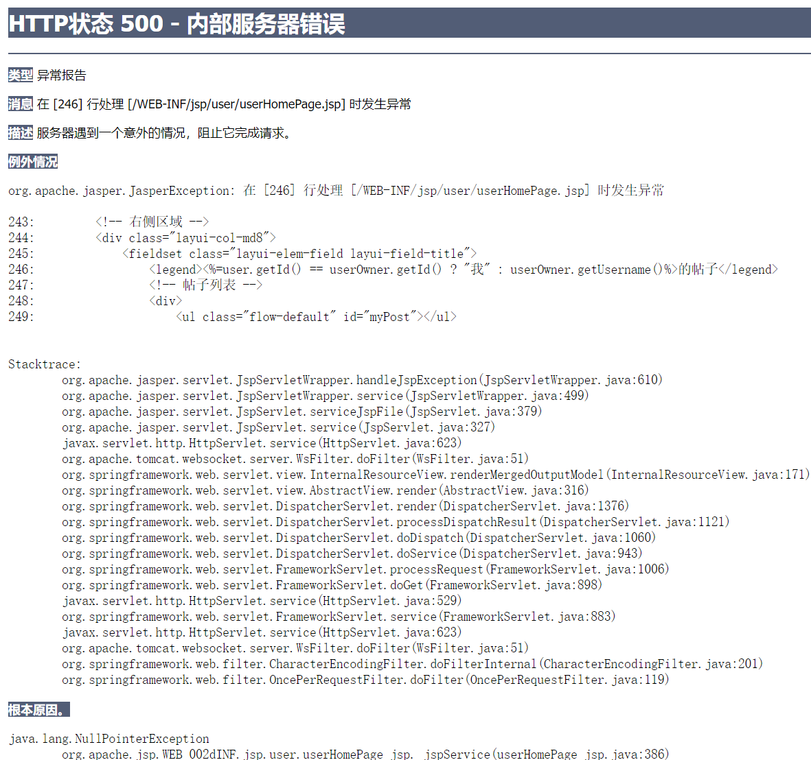

# RainboWzhFreeForum

##

1. 用户flag位
    - 0：用户
    - -1：管理员
    - -2：注销用户
    - -3：封禁用户
2. 帖子flag位
    - 1：可见贴
    - -1：公告
    - 0：被删除（封禁）
3. 评论flag位
    - 1：可见评论
    - 0：被删除（封禁）
4. 违禁词flag位
    - 1：启用
    - 0：禁用

## 2023

## 12.1

完成了

用户登录和注册功能【滑块校验，头像上传(需要更新资源)】

主页的分页帖子&用户信息展示

主页检测session提示登陆，退出

## 12.2

帖子详情【评论功能】

用户主页【未实现留言记录】

点击用户头像跳转到其主页

对帖子发表评论

## 12.3 发烧了

注册时上传头像可显示

试了试AOP捕获异常。可以是可以，但是没法[跳转](src/main/java/com/acn/controller/GlobalExceptionHandler.java)

## 12.4 复习

用户主页删除帖子、显示留言记录、删除留言记录、点击留言记录跳转到对应的帖子

## 12.5 复习

搜索功能【待完善flag标记位：普通用户是否可见】：模糊查询帖子标题，内容，用户名

学习了拦截器的使用

为了解决这个Nullpo，需要一个[拦截器](src/main/java/com/acn/controller/LoginInterceptor.java)，如果没有登陆就自动跳转到login界面

1. 作用范围不同:
   过滤器是 JavaEE 规范的一部分，它在 Servlet 容器内部工作，对所有的请求和响应进行过滤，包括对静态资源的访问。过滤器在请求进入
   Servlet 容器之前，以及响应返回给客户端之前生效。<br>
   拦截器是 Spring MVC 框架提供的一部分，它工作在 Spring MVC 的上下文中，只对进入 Spring MVC 的请求进行拦截处理，不处理静态资源的请求。
2. 配置方式不同:
   过滤器配置在 web.xml 文件中，通过 <filter> 和 <filter-mapping> 元素进行配置。<br>
   拦截器通过在 Spring 配置文件中配置，使用 HandlerInterceptor 接口进行实现，通过 <mvc\:interceptors> 元素进行配置。
3. 对请求和响应的控制程度不同:
   过滤器对请求和响应的控制较为灵活，可以对请求和响应进行任意操作，如修改请求头、响应头，重定向等。<br>
   拦截器主要用于对请求进行预处理和对响应进行后处理，更关注于处理方法调用前后的逻辑，无法像过滤器那样完全控制请求和响应。
4. 是否依赖于 Servlet:
   过滤器是 JavaEE 的一部分，完全依赖于 Servlet 容器，因此不能脱离 Servlet 容器使用。<br>
   拦截器是 Spring MVC 的一部分，不依赖于 Servlet 容器，可以脱离 Servlet 容器独立使用。
5. 总体而言，过滤器更为通用，适用于处理各种类型的请求和响应，而拦截器更专注于对 Spring MVC 控制器的请求进行处理。

## 12.6 发烧了 修改用户信息还没调试完

## 12.7 大雪，烧得更厉害了

优化了search页面的函数，修复了点击“按最新”“按最热”后帖子不能跳转的bug

完善了用户信息修改页面

学到了使用ajax上传头像的注意事项:

1. enctype="multipart/form-data"
2. processData: false, // 告诉 jQuery 不要处理发送的数据
3. contentType: false // 告诉 jQuery 不要设置 Content-Type 请求头
4. 使用CommonsMultipartFile

## 12.8

修复了不是自己主页也能删除别人帖子的bug

## 12.9-12.17

准备考试+发烧休息

## 12.18

发帖功能

## 12.19

公告的增删改查以及点击公告显示详情。

## 12.20

管理员面板的用户分页显示【未实现权限管理】

## 12.21

实现了管理员面板的用户权限管理

实现了拦截已注销用户和封禁用户的登录功能

## 12.22

用户发帖的标题限制在十个字符以内

使用了Echarts图集展示热门话题（通过回帖数量的大小确定圆圈半径），点击热门话题就会跳转到该帖子

## 12.23

完善了管理员面板的用户管理（添加了用户搜索功能）

开始写帖子管理模块

## 12.24

完善了管理员面板的帖子搜索功能；点击帖子弹出评论管理，评论管理可以封禁该评论，点击用户跳转到该主页

完善了对含有封禁词的帖子可见性的修改操作

在实现添加违禁词时出现了一个并发的问题？？可能是因为iframe？（提交一次添加违禁词会在数据库中insert两次）
> Skipped breakpoint at com.acn.controller.adminController:210 because of stepping in another thread

[我的解决方法](src/main/webapp/WEB-INF/jsp/admin/Illegal.jsp)

```
let isSubmitting = false;
form.on('submit(submitIll)', function () {
    if (isSubmitting) {
        // 如果正在提交中，不执行后续操作
        return false;
    }
    isSubmitting = true;  // 标记为正在提交
    $.ajax({
    。。。
```

## 12.25

实现了热门的页面

## 12.26

新增消息功能，用户可以查阅自己帖子的历史评论以及新评论

（前端页面未完成，SQL想了好久）

## TODO

1. 使用监听器统计访问人数
2. 密码加盐加密，uuid
3. 消息提示